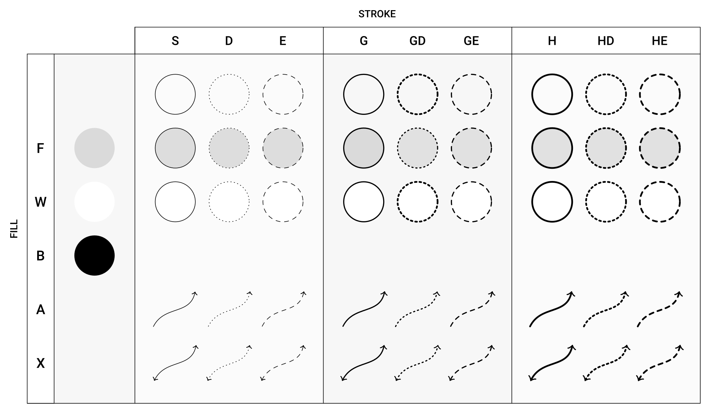

# wayland-inkscape-helper
Rust implementation of [inkscape-shortcut-manager](https://github.com/gillescastel/inkscape-shortcut-manager) written in rust with wayland support

Default key chords are (credits to [inkscape-shortcut-manager](https://github.com/gillescastel/inkscape-shortcut-manager), for more information read also [Gilles Castel Blog](https://castel.dev/post/lecture-notes-2/))

